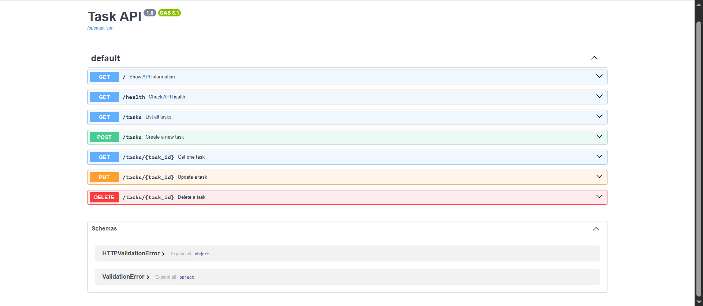

# Task API

A simple CRUD API built with Python and FastAPI. It manages tasks using an in-memory list.

## Features

- Create tasks
- List all tasks
- Get one task
- Update tasks
- Delete tasks
- Input validation
- JSON error responses
- Swagger UI documentation

## Installation

```bash
git clone https://github.com/asmahussain48/task-api.git
cd task-api
python -m venv .venv
.venv\Scripts\activate
python -m pip install -r requirements.txt
```

## Run the API

```bash
python -m uvicorn main:app --reload
```

Swagger UI is available at:

```text
http://127.0.0.1:8000/docs
```

## Endpoints

| Method | Endpoint | Description | Status |
|---|---|---|---|
| GET | `/` | API information | 200 |
| GET | `/health` | Health check | 200 |
| GET | `/tasks` | List tasks | 200 |
| GET | `/tasks/{task_id}` | Get one task | 200 |
| POST | `/tasks` | Create task | 201 |
| PUT | `/tasks/{task_id}` | Update task | 200 |
| DELETE | `/tasks/{task_id}` | Delete task | 204 |

## Example curl Output

```text
curl -i http://127.0.0.1:8000/tasks

HTTP/1.1 200 OK
content-type: application/json

[
  {"id":1,"title":"Learn FastAPI","done":false},
  {"id":2,"title":"Build CRUD API","done":false},
  {"id":3,"title":"Push project to GitHub","done":true}
]
```

## Swagger UI



## Storage

Tasks are stored in memory and reset whenever the server restarts.